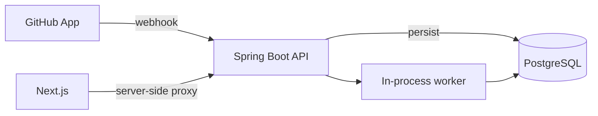

<p align="center">
  
</p>

<h1 align="center">Pato Commit</h1>

<p align="center">
  <strong>Your GitHub repositories have things to tell you.</strong>
</p>

<p align="center">
  A self-hosted developer inbox for pull requests, issues, failing workflows
  and repository activity that actually needs your attention.
</p>

<p align="center">
  <a href="https://www.oracle.com/java/technologies/downloads/">
    
  </a>
  <a href="https://spring.io/projects/spring-boot">
    
  </a>
  <a href="https://nextjs.org">
    
  </a>
  <a href="https://www.postgresql.org">
    
  </a>
  <a href="LICENSE">
    
  </a>
  <a href="https://github.com/danieltinois/pato-commit/actions/workflows/ci.yml">
    
  </a>
</p>

## What is Pato Commit?

> What needs my attention across my GitHub repositories right now?

A **developer inbox** is one list of work that has reached you and is waiting on
a decision: a pull request to review, an issue nobody has answered, a workflow
that just went red, an alert nobody else will touch. Pato Commit builds that
list from your own repositories and runs on your own machine.

It is a modular monolith. One Spring Boot process, one PostgreSQL database, no
broker, no Redis. Quack.

**Implemented today:** local infrastructure and CI (M0), and a verified,
deduplicated, durable webhook intake (M1). **Planned:** the GitHub App
integration (M2) and the inbox itself (M3 onwards). The
[roadmap](#roadmap) is the honest version of that sentence.

## How it works



The worker runs inside the API process, and the queue is a table: a delivery is
committed to PostgreSQL before the HTTP response is sent, then claimed and
processed. Crash recovery is the same code path as normal processing. The
browser only ever talks to its own origin — Next.js proxies `/api/backend/*` to
the API server-side, so no credential has to reach client-side JavaScript.

## Design principles

- **PostgreSQL is the source of truth.** Flyway owns the schema; Hibernate runs
  with `ddl-auto: validate`, so drift fails the boot instead of hiding.
- **Persist before processing.** A delivery is durable before the request is
  answered, so a crash cannot drop an event.
- **Deliveries are idempotent by ID.** `X-GitHub-Delivery` is the primary key:
  a redelivery collides with the existing row instead of duplicating it.
- **Claims are atomic; handler effects are not.** A conditional
  `UPDATE ... WHERE status = 'PENDING'` gives one claim per delivery, but what
  runs after the claim is not transactional with it, so handlers write
  idempotently.
- **No broker, no Redis, until a measured limit demands one.** Added at the
  point of need, against a number, not in advance.
- **Local-first while authentication is deferred.** The API binds to
  `127.0.0.1` and stays there; authentication comes first, exposure second.
- **Least privilege for GitHub.** The installation carries repository access, so
  the login planned for M8 asks only for `read:user` and `user:email`.

## Stack

| Layer       | Choice                                                           |
| ----------- | ---------------------------------------------------------------- |
| Web         | Next.js 16.3 (App Router), TypeScript, Tailwind CSS 4, shadcn/ui |
| API         | Java 25 LTS, Spring Boot 4.1.1, Maven                            |
| Data        | PostgreSQL 18 (source of truth), Flyway (schema)                 |
| Local infra | Docker Compose                                                   |

Redis is intentionally absent: nothing in the MVP needs it. See
[ADR 0001](docs/adr/0001-modular-monolith-without-broker-or-redis.md) for the
conditions that would change that.

## Project structure

```
apps/
  api/                     Spring Boot API
    src/main/resources/db/migration/   Flyway migrations
  web/                     Next.js UI
.github/workflows/ci.yml   CI
assets/                    Logo
compose.yaml               Local PostgreSQL
docs/adr/                  Architecture decision records
```

## Running locally

Prerequisites:

- JDK 25 (Temurin)
- Node.js 24 (LTS) — see `apps/web/.nvmrc`
- Docker Desktop

Maven is **not** required: the API ships a Maven Wrapper
(`apps/api/mvnw`, `apps/api/mvnw.cmd`) that pins the Maven version inside the
repository.

```bash
# 1. Local PostgreSQL
docker compose up -d --wait

# 2. API  -> http://127.0.0.1:8080
cd apps/api && ./mvnw spring-boot:run

# 3. Web  -> http://localhost:3000
cd apps/web && npm install && npm run dev
```

On Windows the wrapper resolves to `.\mvnw.cmd`:

```powershell
cd apps\api; .\mvnw.cmd spring-boot:run
```

The API has **no authentication yet** and is therefore bound to `127.0.0.1`
only. Do not widen `server.address` before M8.

### Configuration

Every setting has a working local default; override through the environment.

| Variable                          | Default                                        |
| --------------------------------- | ---------------------------------------------- |
| `PATO_COMMIT_DATASOURCE_URL`      | `jdbc:postgresql://127.0.0.1:5432/pato_commit` |
| `PATO_COMMIT_DATASOURCE_USERNAME` | `pato_commit`                                  |
| `PATO_COMMIT_DATASOURCE_PASSWORD` | `pato_commit`                                  |
| `PATO_COMMIT_API_PORT`            | `8080`                                         |
| `PATO_COMMIT_API_ORIGIN` (web)    | `http://127.0.0.1:8080`                        |
| `PATO_COMMIT_GITHUB_WEBHOOK_SECRET` | empty — every delivery is rejected while unset |

Actuator endpoints: `/actuator/health`, `/actuator/info`, `/actuator/metrics`,
`/actuator/prometheus`.

## GitHub App

Pato Commit is designed to run as a **GitHub App**: access is granted per
installation and per repository, so there is no personal access token lying
around for the duck to quack out of a log.

**Today (M1):** `POST /api/webhooks/github` verifies `X-Hub-Signature-256`,
deduplicates by delivery ID and persists the delivery before answering. The
`ping` handler exists to prove the path end to end; no other event type is
handled yet.

**In M2:** `PATO_COMMIT_GITHUB_APP_ID` and `PATO_COMMIT_GITHUB_PRIVATE_KEY`,
installation and repository sync, the installation-token cache, and pointing an
App's webhook URL at the endpoint above. Credentials are read from the
environment and must never be committed.

## Webhook processing

GitHub delivers webhooks at least once. Pato Commit takes that literally: the
duck does not quack twice, the claim is atomic, and the work after the claim is
not.

- **Signature verification** — HMAC-SHA256 over the raw request bytes, compared
  in constant time, before anything else looks at the payload. With no secret
  configured, every delivery is rejected.
- **Deduplication** — the delivery ID is the primary key and the insert is
  `ON CONFLICT DO NOTHING`, so a redelivery collides instead of duplicating.
- **Atomic claim** — `UPDATE ... SET status = 'PROCESSING' WHERE delivery_id = :id
  AND status = 'PENDING' RETURNING *`. Races serialise on the row lock, and only
  the winner gets a row back.
- **Stale recovery** — a scheduled sweeper re-claims rows that are `PENDING` or
  `PROCESSING` past a timeout, so a crash mid-handler leaves work for the next
  sweep instead of a stuck row. Failures retry up to `max-attempts`, then go
  terminal as `FAILED`.

Because the claim is atomic but the work inside a handler is not transactional
with it, handler side effects must be idempotent.

## Schema

Flyway owns the schema, in
`apps/api/src/main/resources/db/migration/`. Hibernate runs with
`ddl-auto: validate` and fails the boot on drift, so the migrations are the only
place a table is defined.

`V1__webhook_delivery.sql` creates `webhook_delivery` — the queue and the audit
trail at once — with the state machine enforced by `CHECK` constraints
(`processed_at` and `processing_started_at` are set exactly when the status
says they should be) and a partial index that keeps the sweeper's scan small
regardless of how many deliveries are already terminal.

## Roadmap

| Milestone | Scope                                               | State   |
| --------- | --------------------------------------------------- | ------- |
| M0        | Foundations, local infra, CI                        | done    |
| M1        | Webhook intake: signature, idempotency, persistence | done    |
| M2        | GitHub App auth, installations, repository sync     | next    |
| M3        | Developer Inbox v1 — PR awaiting review             | planned |
| M4        | Inbox breadth — issues, awaiting response           | planned |
| M5        | Inbox — failing and flaky workflows                 | planned |
| M6        | Inbox — Dependabot and security alerts              | planned |
| M7        | Hardening — rate limits, repo activity signal       | planned |
| M8        | Authentication and exposure (deferred)              | planned |

M3 is when the duck starts earning its keep.

## The duck

The duck is the mascot, and the logo is the duck. It reviews nothing, deploys
nothing, and is not in the deploy path. It is the one part of this project
allowed to be unserious; everything else stays as boring as it needs to be.

## Architecture decisions

Decisions worth arguing about are written down instead of implied:

- [0001 — Modular monolith, no message broker and no Redis](docs/adr/0001-modular-monolith-without-broker-or-redis.md)
- [0002 — No authentication until M8; the API is bound to loopback](docs/adr/0002-no-authentication-until-m8.md)

Each record states its context, the decision, the consequences, and the
conditions that would make it worth revisiting.

## Contributing

Issues and pull requests are welcome. Before opening a pull request, make sure
the suite is green — it is the same check CI runs:

```bash
# API: the integration tests use Testcontainers, so Docker must be running
cd apps/api && ./mvnw -B -ntp clean verify

# Web
cd apps/web && npm run lint && npm run typecheck && npm run build
```

On Windows use `.\mvnw.cmd` in place of `./mvnw`. Keep a change scoped to one
milestone, and say in the description which ADR it touches or why none.

## License

[MIT](LICENSE). The shortest license that works.
